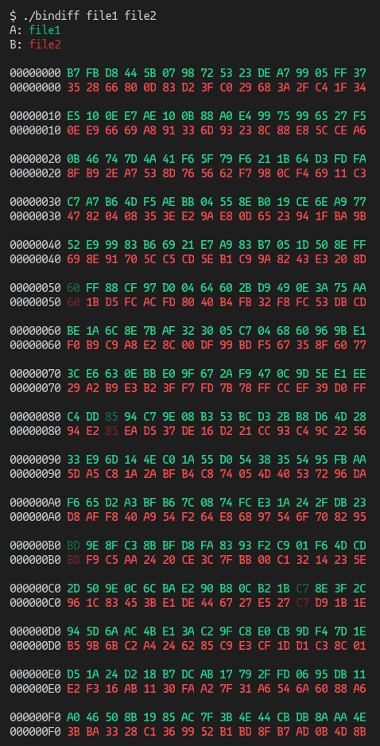

# bindiff
binary file diff utility for Unicode enabled consoles

# Build
`gcc bindiff.c -o bindiff`

# Usage
Basic:

`./bindiff <path/to/file/one> <path/to/file/two>`

With less:

`./bindiff <path/to/file/one> <path/to/file/two> | less -R`

Output:

